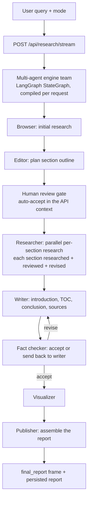

# Architecture

How the v2 system fits together — components, data flow, and the reasoning
behind the design decisions that differ from a standard RAG chatbot.

---

## Pipeline



The engine team is driven by `app/engine/orchestrator.py`, which streams node
updates as the graph runs. The API route (`app/api/routes.py`) translates those
updates into the frontend's NDJSON events and owns the run/session lifecycle,
persistence and replay capture.

Two seams connect the engine to the rest of the product, both installed at
startup by `app.engine.configure`:

* **Generation** (`app/engine/llm_bridge.py`) — every engine LLM call is routed
  through `app.core.llm.LLMClient`, so the provider or fallback chain selected
  in the Model Control Center governs engine generation, and the client's
  circuit breakers, response cache, usage ledger and concurrency cap apply.
* **Retrieval** (`app/engine/retriever_bridge.py`) — the engine's web search is
  backed by `app.agents.search.SearchClient` (SearXNG with Wikipedia / arXiv /
  Crossref fallbacks), reusing the already-fetched page bodies.

The engine itself lives under `backend/engine/` (`gptr/` research core +
`multi_agents/` agent team), vendored as a self-contained, importable package.

---

## Synthesis: structured internally, adaptive externally

The pipeline determines **what is known**; the synthesis layer determines
**what matters for this question**; the presentation layer determines **how to
communicate it**. These three responsibilities are deliberately separate.

```text
evidence state ──> ADAPTIVE ANSWER BLUEPRINT ──> synthesis ──> primary answer
                        (question + evidence)                 (clean, cited)
                                                                     +
                                                              audit / trace
```

* **Evidence state** is the verified fact pool, contradictions, independence and
  temporal profile — produced by the research pipeline and unchanged by
  synthesis.
* **Adaptive answer blueprint** (`app/agents/outline.py`, `AnswerBlueprint`) is
  a deterministic, LLM-free plan for HOW to communicate: the presentation
  strategy for the question family (comparison by criterion, mechanism chain,
  ordered steps, options + trade-offs, thematic synthesis, concise definition),
  the dominant themes the evidence supports, and the depth. It names no
  headings.
* **Primary answer** is the synthesizer's prose. For every profile except
  `audit` it is returned verbatim, with no injected report skeleton. The only
  machine-appended tail is the numbered source legend (citations stay visible).
* **Audit / trace** (`build_answer_audit`, the `final_audit` field) holds
  research provenance: confidence and its caveats, the measured five-axis
  quality score, the supporting-evidence ledger, source conflicts, the decision
  layer, and measured evidence accounting. None of it is mixed into the answer.

**Modes scale effort, not format.** Quick/standard/deep differ in research
breadth, triangulation and synthesis depth. They do not switch between unrelated
fixed report templates: every profile is adaptive, and report structure emerges
from the question and the evidence.

---

## Component map

### Engine (research + synthesis)

| Module | Responsibility |
|---|---|
| `backend/engine/multi_agents/` | The agent team: orchestrator (ChiefEditor graph), editor/planner, researcher, reviewer/reviser, writer, fact checker, visualizer, publisher. |
| `backend/engine/gptr/` | The shared research core the team calls: research conductor, context/compression, retrievers and scrapers, report generation, prompts. |
| `app/engine/orchestrator.py` | Builds the team task from a request, compiles the graph, streams node updates, captures engine log signals, and assembles the final state (report + sources). |
| `app/engine/llm_bridge.py` | Routes the engine's LLM funnel to `LLMClient` (Model Control Center governs generation). |
| `app/engine/retriever_bridge.py` | Backs the engine's web search with `SearchClient`, declaring `requires_scraping=False` to reuse fetched bodies. |
| `app/engine/event_adapter.py` | Maps engine node events onto the frontend's NDJSON vocabulary and builds the terminal `final_report` frame. |

### Retained analysis & support

| Module | Responsibility |
|---|---|
| `app/agents/search.py` | `SearchClient`: multi-provider retrieval (SearXNG / Wikipedia / arXiv / Crossref), circuit breakers, canonical-URL dedup, domain diversity, disk cache, page fetch. |
| `app/agents/sources/`, `app/agents/evidence_utils.py` | Source classification, reliability, freshness, corroboration-query building, claim/number extraction, answer-support scoring — the shared evidence vocabulary. |
| `app/agents/budget.py` | Four ceilings (USD/tokens/calls/seconds), mode multipliers, can-afford-pass protocol. |
| `app/core/confidence.py` | Confidence engine: base signals + citation support + axis coverage + pool-size-scaled contradiction penalty; degraded-run cap 0.55. |
| `app/core/contradictions.py` | Three detectors (polarity, temporal, unit-aware numeric), severity ordering, cap 5. |
| `app/core/semantic.py` | TF-IDF hybrid engine: stemming, synonym canonicalization, negation weighting, vectorized batch scoring. |
| `app/core/evidence_grade.py`, `app/core/investigation_state.py` | Claim grading (claim→source→verification→independence→corroboration→contradiction) and per-claim investigation memory. |
| `app/graph/evidence.py`, `app/graph/state.py` | Shared evidence-acquisition helpers (`_claim_terms`, corroboration/coverage-gap functions) and the research-state TypedDict, retained after the orchestration removal. |

### Control & efficiency

| Module | Responsibility |
|---|---|
| `app/core/usage.py` | Per-run ledger (ContextVar): LLM tokens/cost, searches, cache hits. |
| `app/core/llm.py` | Provider chain with breakers, fail-fast auth/quota errors, Retry-After honoring (capped 3s), JSON mode, usage parsing, probe caching; the single generation funnel for both the engine and the retained helpers. |
| `app/core/llm_cache.py` | Exact-prompt disk cache (TTL 6h, size-capped). |
| `app/core/semantic.py`, `app/core/isolation.py` | Shared similarity engine and per-sub-question AgentContext isolation. |

### Surfaces

| Module | Responsibility |
|---|---|
| `app/api/routes.py` | NDJSON stream, resume, trace, export, sessions; provider CRUD + latency probe live in `app/api/providers_routes.py`. |
| `app/db/sqlite.py` | Auto-initialized schema (WAL), `file:`/`sqlite://` URL forms. |
| `frontend/` | React mission console: thread, answer card, claim drawer, intelligence panel, Model Control Center. |

---

## NDJSON event schema (`POST /api/research/stream`)

| Event | Payload highlights |
|---|---|
| `progress` | `request_id`, `session_id`, `message` (includes per-stage progress labels) |
| `plan` | `items` (report sections), `orchestration`, `waves` |
| `search_progress` | `snippets` (progress count as research proceeds) |
| `critic` | `iteration`, `reason` (fact-checker revision notes), `breakdown` |
| `final_report` | `report` (the primary answer), `confidence`, `degraded`, `audit`, `degraded_reasons`, `citation_health`, `quality`, `outline` |
| `error` | `message` (actionable: key/quota/timeout causes) |

Event types the engine team has no genuine signal for (`intent`, `route`,
`direct_answer`, `findings`, `search_query`, `decisions`) are deliberately not
fabricated; the frontend treats every event type as optional.

---

## Design decisions worth knowing

**Why the engine is vendored, not a runtime dependency.** `backend/engine/`
holds the multi-agent engine locally so the backend imports it without an
external checkout and pins exactly what runs. Its internal absolute imports
(`gptr.*`, `multi_agents.*`) are preserved by a one-time `sys.path` bootstrap
in `engine/__init__.py`.

**Why the provider stack is bridged, not duplicated.** The engine has its own
config and provider layer, but the product's contract is that the Model
Control Center decides what runs. The bridge routes the engine's single LLM
funnel through `LLMClient`, so one mechanism (active provider or enabled chain,
with its breakers/cache/ledger) governs all generation — no second provider
configuration to drift.

**Why retrieval is shared.** The engine's retriever seam is backed by
`SearchClient`, so web search behaves identically to the rest of the product
(SearXNG + Wikipedia/arXiv/Crossref fallbacks, the same caches and health
accounting), and page bodies fetched here are reused by the engine instead of
re-scraped.

**Why the LLM cache is exact-prompt.** Semantic caching returns subtly
wrong answers to slightly different questions. Research pipelines re-issue
*identical* prompts — an exact-hit cache captures that traffic with zero
correctness risk.

**Why "not" is not a stopword.** The negation token weighted like a number
is what keeps "X" and "not X" from merging in dedup, keeps them inside the
contradiction band, and keeps citation support from counting a negation as
an affirmation. (Found by the benchmark suite, not by intuition.)

**Why MAX_PARALLEL_LLM is low.** Concurrent large prompts are exactly what
exhausts free-tier TPM/TPD quotas (observed live: Groq 200k daily tokens
burned by 3 parallel calls). The semaphore bounds in-flight prompts, not
threads.

**Why process mechanics never reach the primary answer.** "Pipeline stage",
"deterministic fallback", evidence grades, budgets and confidence floats
describe the research system, not the subject. They belong in the audit layer,
not the answer.

---

## Data lifecycles

- **Raw page content** is used during research and not persisted; the trace
  keeps snippets for transparency.
- **Facts** accumulate across research passes; dedup merges restatements and
  corroboration counts distinct domains only — self-syndication is not
  corroboration.
- **Caches**: search results 1h, LLM responses 6h, both size-capped and
  LRU-evicted.
- **SQLite**: every run persists agent events, sources, claims, verification
  results, contradictions, citations, critic reviews and the final report —
  the trace endpoint reconstructs the full timeline, and the verbatim NDJSON
  frames are stored for replay.
